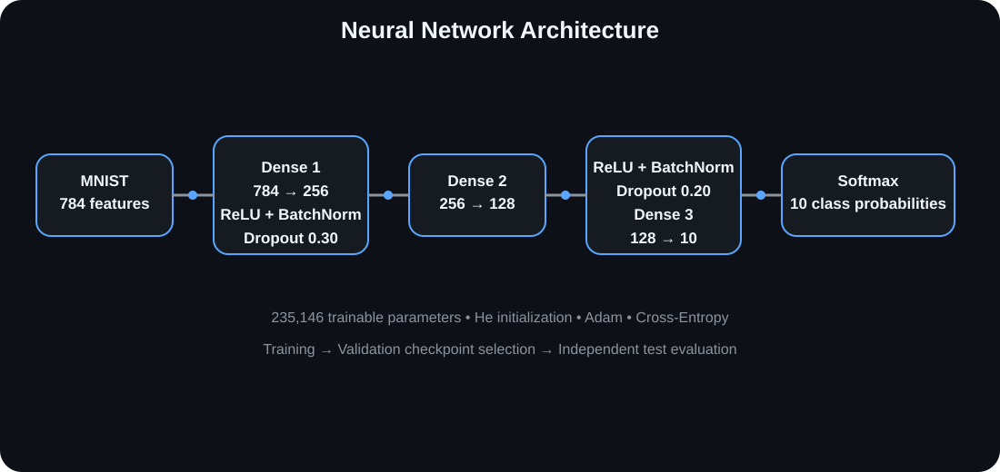
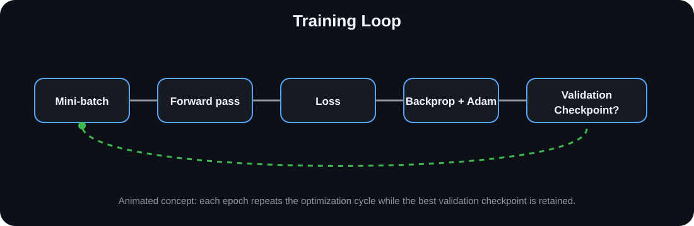
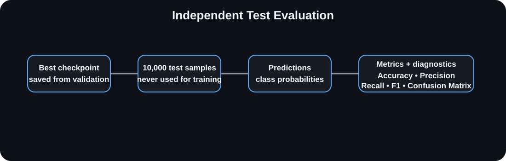
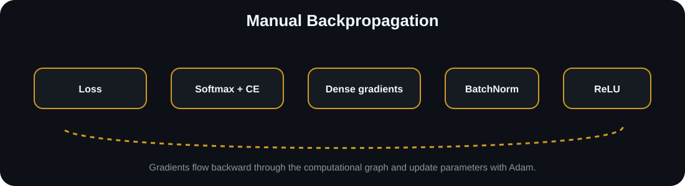

# Neural Network from Scratch

<p align="center">
  <strong>A NumPy-only neural network built from first principles for MNIST classification.</strong><br/>
  Manual forward propagation, backpropagation, BatchNorm, Dropout, Softmax, Cross-Entropy, Adam, checkpointing, evaluation, and visualization — without PyTorch or TensorFlow.
</p>

<p align="center">
  
  
  
  
  
</p>

---

## Overview

This project implements a fully connected neural network **from scratch using NumPy**.

The goal is not to reproduce `model.fit()` with a different syntax. The goal is to understand and implement the mechanics that deep-learning frameworks normally hide:

- tensor operations and matrix multiplication
- parameter initialization
- forward propagation
- activation functions
- Batch Normalization
- inverted Dropout
- numerically stable Softmax
- Cross-Entropy loss
- manual backpropagation
- Adam optimization with bias correction
- learning-rate decay
- validation-based checkpoint selection
- independent test-set evaluation
- classification metrics and visual diagnostics

**No PyTorch. No TensorFlow. No high-level neural-network framework.**

---

## Why Build It From Scratch?

Modern ML work becomes much easier to reason about when the underlying mechanics are understood.

This implementation was built to answer questions such as:

- What exactly happens during a forward pass?
- How does the loss propagate backward through each layer?
- Why does Softmax need numerical stabilization?
- What does Dropout actually do during training?
- Why does BatchNorm behave differently during inference?
- How does Adam update each parameter?
- How do we know whether a model actually generalizes?

The repository therefore treats the neural network as an **engineering and learning system**, not just a trained model.

---

## Architecture



The model is a compact fully connected classifier:

```
MNIST → Flatten/Normalize → Dense(784→256) → ReLU → BatchNorm → Dropout
      → Dense(256→128) → ReLU → BatchNorm → Dropout
      → Dense(128→10) → Stable Softmax
```

### Model specification

| Component | Configuration |
|---|---|
| Input | 784 features |
| Hidden layer 1 | 256 units |
| Hidden layer 2 | 128 units |
| Output | 10 classes |
| Activation | ReLU |
| Normalization | BatchNorm |
| Regularization | Inverted Dropout |
| Output activation | Stable Softmax |
| Loss | Cross-Entropy |
| Optimizer | Adam |
| Parameters | 235,146 |
| Initialization | He / Kaiming |
| Random seed | 42 |

### Forward → backward → update



## Training Setup

The current training configuration is:

```text
Epochs:          50
Batch size:      128
Learning rate:   0.001
Adam β1:         0.9
Adam β2:         0.999
Adam ε:          1e-8
LR decay:        0.95 every 10 epochs
Seed:            42
```

The data flow is deliberately separated:

```
MNIST
 ├── Training set  → parameter updates
 ├── Validation set → model selection
 └── Test set       → final evaluation
```

The best checkpoint is selected using **validation accuracy**, while the test set remains untouched until final evaluation.

---

## Mathematical Foundations

### Dense layer

```text
Z = XW + b
```

### ReLU

```text
ReLU(z) = max(0, z)
```

### Batch Normalization

For batch statistics `μ` and `σ²`:

```text
x̂ = (x - μ) / √(σ² + ε)
y = γx̂ + β
```

### Inverted Dropout

During training, activations are randomly masked and scaled by the inverse keep probability so that inference does not require an additional rescaling step.

### Stable Softmax

The implementation uses the log-sum-exp stabilization strategy to avoid numerical overflow when exponentiating large logits.

### Cross-Entropy

```text
L = -Σ y log(ŷ)
```

### Softmax + Cross-Entropy gradient

For one-hot targets:

```text
δ = (ŷ - y) / m
```

This fused gradient avoids explicitly constructing the Softmax Jacobian.

---

## Backpropagation

Gradients are implemented manually rather than delegated to an automatic-differentiation framework.

The backward pass propagates gradients through:

1. Softmax + Cross-Entropy
2. output Dense layer
3. Dropout
4. BatchNorm
5. ReLU
6. hidden Dense layers

For a dense layer:

```text
dW = Aᵀδ
db = Σδ
dA = δWᵀ
```

This makes the repository useful as a compact reference for understanding how a multilayer neural network learns.

---

## Adam Optimizer

The optimizer implements Adam with first- and second-moment estimates and bias correction:

```text
mₜ = β₁mₜ₋₁ + (1 - β₁)gₜ
vₜ = β₂vₜ₋₁ + (1 - β₂)gₜ²

m̂ₜ = mₜ / (1 - β₁ᵗ)
v̂ₜ = vₜ / (1 - β₂ᵗ)

θ ← θ - α · m̂ₜ / (√v̂ₜ + ε)
```

---

## Evaluation

The repository includes a dedicated `evaluate.py` pipeline.

It:

1. loads the held-out MNIST test set
2. loads the saved best checkpoint
3. generates predictions for the full test set
4. calculates accuracy
5. calculates macro precision
6. calculates macro recall
7. calculates macro F1
8. calculates per-class F1
9. generates a confusion matrix
10. writes the evaluation report to `results/evaluation.json`

Run:

```bash
python evaluate.py
```

Example output format:

```text
Test Accuracy: XX.XX%
Macro Precision: XX.XX%
Macro Recall: XX.XX%
Macro F1: XX.XX%
```

The test set is used only for final evaluation, not for parameter updates.

---

## Reported Results

The repository currently reports the following benchmark values:

| Metric | Reported value |
|---|---:|
| Test Accuracy | **97.4%** |
| Macro Precision | **97.0%** |
| Macro Recall | **97.0%** |
| Macro F1 | **97.0%** |
| Best class | Digit 1 — 99.2% F1 |
| Lowest reported class | Digit 5 — 95.5% F1 |
| Trainable parameters | **235,146** |

> **Reproducibility note:** these values are repository-reported benchmark results. Run `python evaluate.py` locally to reproduce the current checkpoint's metrics.

---

## Diagnostics & Visualizations

The repository includes a dedicated visualization pipeline:

```bash
python visualize.py
```

The generated charts are experiment artifacts rather than static documentation assets. This keeps the repository clean while allowing every plot to be regenerated from the current checkpoint and `results/history.json`.

### Evaluation flow



### Training and model internals



### Generated diagnostics

After running `python visualize.py`, the following files are produced locally:

| Artifact | Purpose |
|---|---|
| `results/loss_curve.png` | Training vs validation loss |
| `results/accuracy_curve.png` | Training vs validation accuracy |
| `results/confusion_matrix.png` | Class-level error distribution |
| `results/weight_distributions.png` | Initial vs final weight distributions |
| `results/sample_predictions.png` | Visual prediction inspection |
| `results/per_class_f1.png` | F1 score by digit |

> **Why are the PNGs not embedded here?** GitHub previously showed broken-image placeholders because those generated files were not committed to the repository. The README now uses versioned SVG documentation assets that always render, while the real experiment plots remain reproducible through `visualize.py`.

## Quick Start

### 1. Clone

```bash
git clone https://github.com/chamanvashishth/neural-net-scratch.git
cd neural-net-scratch
```

### 2. Install dependencies

```bash
pip install -r requirements.txt
```

### 3. Train

```bash
python train.py
```

MNIST is downloaded automatically on first run.

### 4. Evaluate the saved model

```bash
python evaluate.py
```

### 5. Generate diagnostics

```bash
python visualize.py
```

---

## Repository Structure

```text
neural-net-scratch/
│
├── src/
│   ├── layers.py
│   ├── losses.py
│   ├── optimizers.py
│   ├── network.py
│   ├── data_loader.py
│   └── metrics.py
│
├── notebooks/
│   └── math_derivations.ipynb
│
├── docs/
│   └── visuals/
│       ├── architecture.svg
│       ├── training-loop.svg
│       ├── evaluation-pipeline.svg
│       └── gradient-flow.svg
│
├── checkpoints/
│   └── ... saved model parameters
│
├── results/
│   ├── history.json
│   ├── evaluation.json
│   └── ... generated plots
│
├── train.py
├── evaluate.py
├── visualize.py
├── requirements.txt
└── README.md
```

### Module responsibilities

| Module | Responsibility |
|---|---|
| `layers.py` | Dense, ReLU, BatchNorm, Dropout, Softmax |
| `losses.py` | Cross-Entropy and numerical stability |
| `optimizers.py` | Adam optimizer |
| `network.py` | Model composition, forward/backward/update |
| `data_loader.py` | MNIST download, preprocessing and batching |
| `metrics.py` | Accuracy, precision, recall, F1 and confusion matrix |
| `train.py` | Training loop and checkpoint selection |
| `evaluate.py` | Independent test-set evaluation |
| `visualize.py` | Evaluation and training diagnostics |

## Design Principles

### 1. Understand before abstracting
Core ML operations are implemented explicitly so the learning process remains inspectable.

### 2. Keep inference separate from training
Dropout and BatchNorm use the appropriate inference behavior when evaluating the model.

### 3. Protect the test set
Validation data is used for model selection; the test set is reserved for final measurement.

### 4. Prefer numerical stability
Softmax and Cross-Entropy are implemented with numerical stability in mind.

### 5. Make experiments reproducible
A fixed random seed and persisted training history make experiments easier to inspect and reproduce.

---

## Dependencies

```text
numpy>=1.24
matplotlib>=3.7
seaborn>=0.12
requests>=2.28
tqdm>=4.65
```

The neural-network implementation itself does not depend on PyTorch or TensorFlow.

---

## What This Project Demonstrates

This project is primarily an **implementation and learning artifact**.

It demonstrates practical understanding of:

- neural-network architecture
- tensor and matrix operations
- gradient-based optimization
- manual differentiation
- regularization
- normalization
- numerical stability
- model checkpointing
- validation vs test methodology
- classification metrics
- model diagnostics

It is also intended to serve as a foundation for moving from framework-level ML usage toward understanding and implementing ML systems from first principles.

---

## Future Directions

Possible extensions include:

- gradient checking with finite differences
- systematic hyperparameter experiments
- stronger experiment tracking
- calibration analysis
- confidence/error analysis
- ablation studies for BatchNorm and Dropout
- additional optimizers
- convolutional layers implemented from scratch
- benchmarking against other scratch implementations

---

## License

This project is licensed under the **MIT License**.

---

## Author

**Chaman Vashishth**

AI/ML Engineering • Machine Learning Systems • Applied AI

- GitHub: https://github.com/chamanvashishth
- LinkedIn: https://www.linkedin.com/in/chamanvashishth

---

<p align="center">
  Built from first principles with NumPy.
</p>
